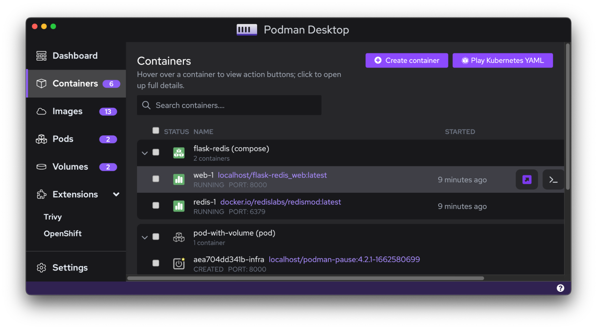

## Introduction

[Podman Compose](https://github.com/containers/podman-compose#readme) is a community-driven tool that allows developers to use the [Compose spec](https://compose-spec.io) to run many containers at the same time. Podman Compose requires a [Compose YAML](https://compose-spec.io/) file with definitions about the containers that need to communicate.

If you have not used a [Compose file](https://github.com/compose-spec/compose-spec/blob/master/spec.md#compose-file) or the [Compose spec](https://compose-spec.io/), visit [this guide](https://github.com/compose-spec/compose-spec/blob/master/spec.md) for more information. 

### Requirements

* [Podman Desktop installed](/docs/installation)
* [Podman Compose installed](https://github.com/containers/podman-compose#installation)

## Getting started 

Spin up your `compose.yaml` with the `podman-compose` binary and Podman Desktop will automatically detect it! 

Use the [Flask Redis project](https://github.com/docker/awesome-compose/tree/master/flask-redis) from the [awesome-compose repository](https://github.com/docker/awesome-compose) as an example project. 

1. Git clone the project and `cd` into the directory:

```sh
git clone https://github.com/docker/awesome-compose
cd awesome-compose/redis-flask
```

2. Run the `podman-compose` command:

```sh
podman-compose -f compose.yaml up -d
```


3. Manage Compose with Podman Desktop

To confirm if the containers are running, open Podman Desktop and click on the ‘Containers’ option on the left side of the application. You will have the containers bundled together under a Pod named `flask-redis (compose)` in this case. Here, the compose within the bracket indicates it has been generated from a Compose YAML file. 



You can further configure or work with these containers within the Podman Desktop application now that they are visible. Here, clicking on the ‘Open Browser’ button allows us to confirm if the application is running expectedly. 


You can do much more such as checking logs, opening the terminal or inspecting the files for more details.

